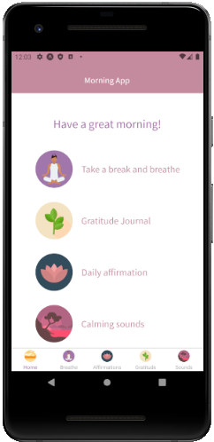
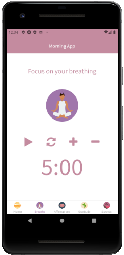
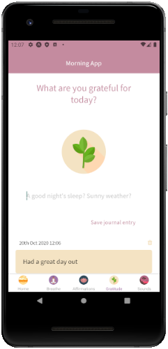
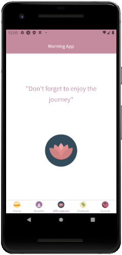
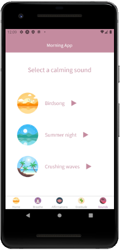

# Morning App
A morning ritual app to help taking back your mornings by developing good habits.  
Take a minute to pause and reflect & stay positive 🌺

### Screens


### Tech stack
* React Native
* React Native Elements
* SQLite

### Features
* Gratitude Journal
* Meditation/ break timer
* Daily affirmation
* Calming sounds (sounds not uploaded to github)

### How to use:

* Clone this repo and navigate to the local folder
* Install all dependencies by typing in the terminal:
```
npm install
```
* To run the app, type in the terminal:
```
expo start
```
* Install the Expo client app on your iOS or Android phone, connect to the same wireless network as your computer
* On Android, use the Expo app to scan the QR code from the terminal to open the project.
* On iOS, follow on-screen instructions to get a link.

### Options to extend the app:

* add new features: set your intentions, exercise, play relaxing audio
* add backend to use additional APIs
* add image upload feature to gratitude journal

### Credits
* Affirmations from affirmations.dev API  
* Lake & lagoon icons by IconPond
* Beach, cape, branch icons by FreePik
* Lotus icons by RoundIcons
* Bird song by reinsamba
(* Summer night sound by eric5335)
* Crushing waves sound by Luftrum
* Paddling sound by Danjocross
* Summer night sound by Legend1060
